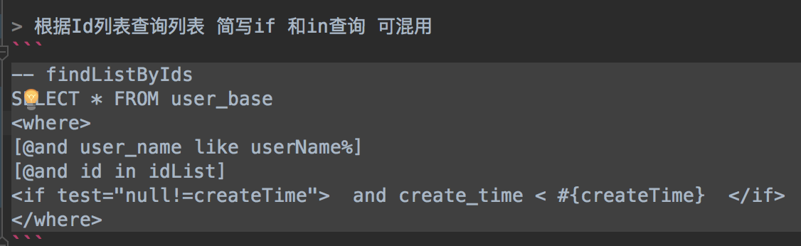

## spring-data-mybatis-mini

**等同于spring data jdbc + mybatis 动态sql能力**

**大道至简**

1. 抛弃繁琐的xml 只使用mybatis模版引擎即动态sql能力 sql写在markdown文件里
   更容易书写和阅读 sql能统一管理查看

2. 底层基于springJdbc 而不是mybatis 更直接纯粹

3. 提供单表增删改(没有删除) 批量更新插入等基础方法 支持分页 读写分离

4. mybatis最大优点就是sql模版引擎
   我也有且仅有使用这部分功能(对于使用过mybatis的无学习成本) 但底层使用springJDBC
   更简单直接 
5. 简化mybatis动态sql写法(可混用-写法还是mybatis那套) 比如

```
[@and id in idList] 等于
<if test="null!=idList and idList.size>0"> and id in <foreach
collection="idList" index="index" item="item" open="(" separator=","
close=")">#{item}</foreach></if>
```


== 与mybatis,jpa,hibernate,mybatis-plus等 比较

1. 无需resultType resultMap 复杂指定(mybatis xml啰嗦的配置)
   只需在markdown里定义方法名
2. 不允许查询sql放到@Select 和 @Query上 jpa复杂sql不容易书写还乱(虽然也能实现)
   保持mybatis风格写在文件里 统一管理 便于维护
3. 无缓存 缓存很容易 但更新是个难题 大多使用mybatis的公司都不会开启一级,二级缓存
   使用不当容易引起脏读 不如使用 SpringCache 等上层方案 自己控制
4. 无jpa根据方法名 (复杂点需要你学习思考,名字老长,不透明)
5. 永远不会提供类似hibernate Criteria,mybatis-plus EntityWrapper这种东西
   查询就该是sql 配合动态sql能力 还有简化写法 减少学习和使用成本
6. 由于markdown 文件表述能力 无法像mybatis那样使用resultMap可以关联结果集映射
   我推荐的是如果没有复杂逻辑 多表join返回映射一个新的实体可直接透传到视图层VO
   或者自己代码里拼接 麻烦点但可控 后期会尝试写新的组件sqlHelper方式简化这些流程
7. 比mybatis有简单的crud  比jpa使用jdbc+动态sql
   比mybatis-plus(越来越像hibernate,jpa 搞Criteria那套 还是mybatis吗
   sql还是要统一管理到文件)更简单 不使用xml 使用jdbc
8. 比较大多是无的功能 但细想这些都不是必须的甚至鸡肋 老老实实简单简单做个纯粹的ORM框架
9. 最大优点就是简单 学习成本极低 入手简单

   

== Getting Started

1. 提供单表增删改(没有物理删除) 批量更新插入等基础方法
2. 抛弃繁琐的xml 所有sql 写在markdown文件里 便于书写和阅读
   默认位置sql包下repository接口名.md @ConfigLocation 可自定义位置
3. 自定义更新 update/save/insert/delete 开头方法是更新操作 
4. 支持分页 分页参数必须是第一个参数 
5. 对于 " > "," < "," >= "," <= "," <> "无需转义(两边需有空格 我会自动替换转义)
6. 提供if判断和in查询简写方式(偷懒 >-<)
7. 注解属于spring data jpa 体系的
8. 支持sql片段 \[@sql XX] XX markdown文件XX名的sql片段
9. 查询返回实体 不需要必须是DO 如果没特殊规范
   也可直接返回VO层实体(抛弃繁琐的DO->DTO->VO 偷懒轻喷)
10. 支持批量更新插入（jdbc链接参数需加入rewriteBatchedStatements=true&allowMultiQueries=true）
11. 分页某些特性支持mysql,oracle 主支持mysql
12. 使用简单 约定大于配置 默认配置基本都满足
13. 支持LocalDateTime LocalTime jdk8更方便的时间类型

== 其他特性 无特殊需要可不用关心 

1. 分页 可自定义同名+Count的sql 优化分页 
2. 支持读写分离 根据业务逻辑添加@ReadDataSource在方法名上 默认配置多数据源随机取
   可自定义
3. 多数源支持但在微服务化潮流里尽量保证同一数据源
   

== 使用步骤基本同jpa,spring data jdbc

1. 添加依赖 
2. @EnableMybatisMini
3. extends BaseRepository<UserBaseDO, Long> 或 extends
   BaseQueryRepository(只查询) 
4. 使用例子demo项目[spring-data-mybatis-mini-demo](https://github.com/VonChange/spring-data-mybatis-mini-demo/blob/master/src/test/java/com/vonchange/nine/demo/dao/UserBaseRepositoryTest.java)
 


 
 
 Here is a quick teaser of an application using Spring Data
Repositories in Java:

=== Maven configuration

Add the Maven dependency:

```
  <!-- spring boot 2.x 是使用版本2.2.3 低版本比如1.5.x 使用版本1.8.5 -->
<dependency>
  <groupId>com.vonchange.common</groupId>
  <artifactId>spring-data-mybatis-mini</artifactId>
  <version>2.2.3</version>
</dependency>

<dependency>
       <groupId>org.springframework.data</groupId>
       <artifactId>spring-data-commons</artifactId>
 </dependency>
 <dependency>
         <groupId>org.springframework.boot</groupId>
         <artifactId>spring-boot-starter-jdbc</artifactId>
 </dependency>
<dependency>
            <groupId>mysql</groupId>
            <artifactId>mysql-connector-java</artifactId>
            <version>8.0.15</version>
</dependency>
```

``` 
import org.springframework.data.mybatis.mini.jdbc.repository.query.ConfigLocation;
import org.springframework.data.mybatis.mini.jdbc.repository.support.BaseRepository;
import org.springframework.data.repository.query.Param;

public interface UserBaseRepository extends BaseRepository<UserBaseDO, Long> {
  @ReadDataSource
  List<UserBaseDO> findList(@Param("userName") String userName,
                          @Param("createTime") Date createTime);
  Page<UserBaseDO> findList(Pageable pageable, @Param("userName") String userName,@Param("createTime") Date createTime);
  String findUserName(@Param("userName") String userName);

  List<UserBaseVO> findListByIds(@Param("userName") String userName,
                           @Param("createTime") Date createTime,@Param("idList")List<Long> idList);

  int updateIsDelete(@Param("isDelete") Integer isDelete,@Param("id") Long id);
  
}
```

> 默认sql 包下同名吧UserBaseRepository.md 识别```开头结尾的 -- 定义的同名方法
> 参见[UserBaseRepository.md](UserBaseRepository.md)


> 实体类 定义ID 和TABLE 名
```
import javax.persistence.Id;
import javax.persistence.Table;

@Data
@Table(name = "user_base")
public class UserBaseDO {
    @Id
    private Long id;
    private String userName;
    private String  firstPhone;

}
```


```

@Service
public class MyService {
  @Resource
  private final UserBaseRepository userBaseRepository;

  public void doWork() {
     List<UserBaseDO> userBaseDOList = userBaseRepository.findList("test",new Date());
 }
}

//添加 EnableMybatisMini 注解 
@EnableMybatisMini
@SpringBootApplication 
public class DemoApplication {
    public static void main(String[] args) {
        SpringApplication.run(DemoApplication.class, args);
    }
} 
```


> 偷懒简化 if test 和in查询 识别 {@开头

>   \[@and id in idList] 等于

```
<if test="null!=idList and idList.size>0"> and id in <foreach
collection="idList" index="index" item="item" open="(" separator=","
close=")">#{item}</foreach></if>
  
  ```
  
>   \[@and user_name <> userName] 等于

```
<if test="null!=userName and ''!=userName"> and user_name <>
#{userName} </if>
   ```
   
3. in 查询List实体下的属性 \[@and id in userList:id]

4.  like 

 ```
 [@and user_name like userName] 等于 and user_name like CONCAT('%',?,'%')  
 [@and user_name like userName%] 等于 and user_name like  CONCAT(?,'%') 
 [@and user_name like userName%] 等于 and user_name like CONCAT('%','test')   
 
 ```
 
5. 其他非4个分隔

```
[@AND C.DESCRIPTION LIKE #{bean.description:like}  or C.title like #{bean.description:like}]
等于
<if test="null!=bean.description and ''!=bean.description">
AND C.DESCRIPTION LIKE  CONCAT('%',#{bean.description},'%')    or C.title like CONCAT('%',#{bean.description},'%')
</if>
 [@AND content -> '$.account' = #{bean.account}]
 等于
 <if test="null!=bean.account and ''!=bean.account">
 AND content -> '$.account' = #{bean.account}
 </if>

```

6. \[@sql XX] XX markdown文件XX名的sql片段

>  相关注解 

1. @ColumnNot 非字段注解 

2. InsertIfNull UpdateIfNull 插入或者更新为空时默认值 可使用函数

3. UpdateNotNull updateAllField方法NULL值忽略

4. ReadDataSource 指定某个方法读数据源 默认配置多数据源随机取 

```
 //自定义 读库数据源 不自定义默认所有你设置的数据源
    @Bean
    public ReadDataSources initReadDataSources(){
        return new ReadDataSources() {
            @Override
            public DataSource[] allReadDataSources() {
                return new DataSource[]{mainDataSource(),mainDataSource(),readDataSource()};
            }
        };
    }
```

> 批量更新插入

1. jdbc链接参数需加入rewriteBatchedStatements=true&allowMultiQueries=true

2. insertBatch updateBatch方法 无需关心List对象大小 

3. 经测试比插入比sql拼接 快5倍 但更新差不多 简单数据插入1万耗时2s多点

